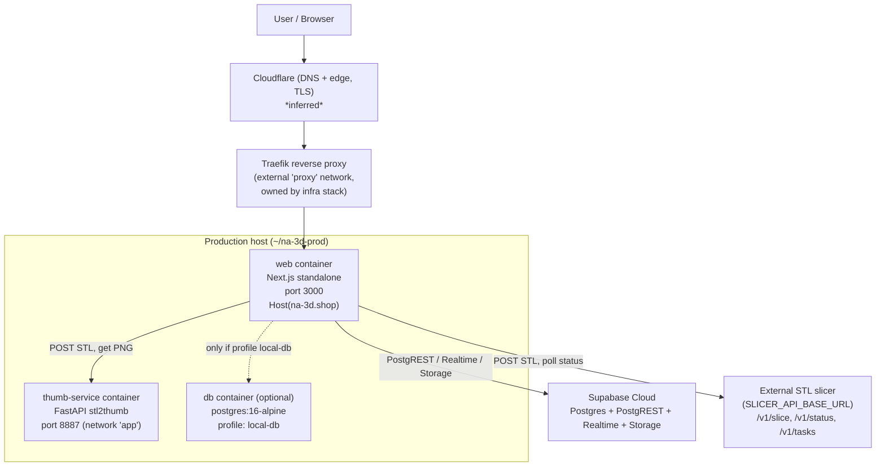
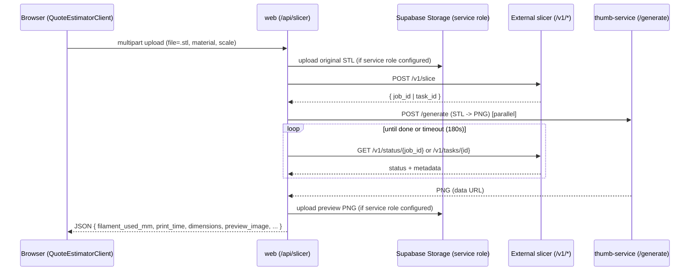
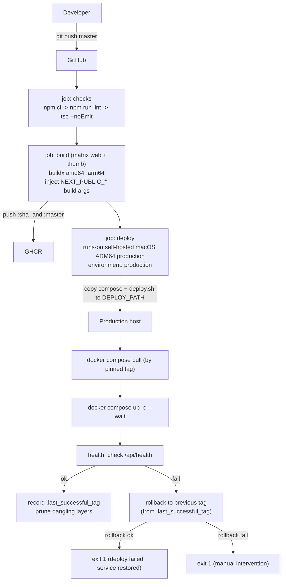
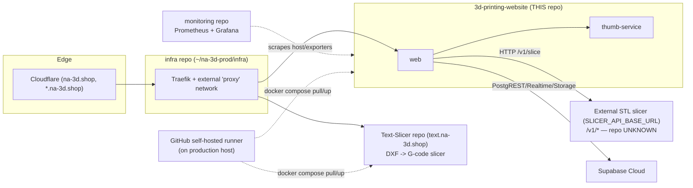

# ARCHITECTURE

> AI-oriented architecture reference for the `3d-printing-website` repository.
> Everything here is inferred from the repository contents (source, `Dockerfile`,
> `docker-compose*.yml`, `.github/workflows/deploy.yml`, `scripts/deploy.sh`,
> `.env`, and sibling repositories found on the same machine). Anything that could
> not be verified from files is explicitly marked **UNKNOWN**.

---

## Project Overview

**What this repository does.** This repository contains **NA 3D SHOP**, a bilingual
(Vietnamese / English) marketing and quoting website for a physical 3D‑printing
workshop in Thủ Đức, Ho Chi Minh City. It is served in production at
`https://na-3d.shop`. Customers can browse the workshop, view live printer
availability, compare filament materials and prices, upload an `.stl` file to get an
**instant slice‑based price quote** (filament length, print time, dimensions), and
submit a checkout request or a bulk request‑for‑quote (RFQ). An `/admin` area exposes
traffic analytics, submitted quote requests, and a gallery manager.

**Purpose.** Convert workshop visitors into leads/orders by giving them immediate,
self‑service quotes without a salesperson, while showcasing the workshop and its
capabilities. Heavy geometry work (slicing, thumbnail rendering) is delegated to
separate services so the web app stays a thin, fast Next.js server.

**Technology stack.**

| Layer | Technology (verified from files) |
|---|---|
| Language | TypeScript (strict) + some Python (`stl2thumb/`) |
| Framework | Next.js 15.5.15 (App Router) + React 19.1.0 |
| Runtime | Node.js ≥ 20 (`package.json` `engines`, Docker base `node:20-bookworm-slim`) |
| Styling | Tailwind CSS v4 (`@tailwindcss/postcss`) |
| Data / backend | Supabase (PostgreSQL, PostgREST, Realtime, Storage, Auth *prepared but disabled*) |
| Thumbnails | FastAPI microservice `stl2thumb/` (Python 3, `stl-thumb` + `xvfb`/Mesa) |
| STL slicing | **External** FastAPI service (`SLICER_API_BASE_URL`, endpoints `/v1/slice`, `/v1/status/{id}`, `/v1/tasks/{id}`) — not defined in this repo |
| UI libs | Framer Motion, Lucide React, react‑dropzone, canvas‑confetti, Recharts (admin) |
| Build output | `output: "standalone"` (self‑contained `server.js`) |
| Packaging | Multi‑stage Docker image; `docker compose` orchestration |
| Registry | GitHub Container Registry (GHCR) |
| CI/CD | GitHub Actions + self‑hosted runner on the production machine |
| Reverse proxy | Traefik (labels in `docker-compose.prod.yml`), external `proxy` network |
| Edge / DNS | `na-3d.shop` — Cloudflare in front of Traefik (*inferred, see Networking*) |

There is **no in‑browser 3D viewer**; previews are server‑generated PNGs.

---

## Directory Structure

The repository is a single Next.js application plus one bundled Python microservice.
Each top‑level directory exists for a specific reason:

- **`app/`** — The Next.js **App Router** tree. It holds both the rendered pages and
  the HTTP API. Vietnamese pages live at the root (`/`, `/bao-gia-in-3d`,
  `/materials`); English pages live under `app/en/*` (`/en`, `/en/3d-printing-quote`,
  `/en/materials`). `app/api/*` contains **Route Handlers** — the app's server-side
  API (health checks, slicer proxy, orders, admin, gallery, exchange rate). `app/admin/*`
  is the protected back‑office. `app/sitemap.ts` and `app/robots.ts` generate SEO
  metadata. This directory exists because App Router couples routing, layouts, server
  components, and API endpoints in one tree.
- **`components/`** — Presentational and interactive React components grouped by
  domain (`landing/`, `quote/`, `nav/`, `admin/`, `materials/`, `orders/`, `pricing/`,
  `seo/`). Separated from `app/` so UI is reusable across the VI and EN route trees.
- **`lib/`** — Framework‑agnostic business logic and integrations: Supabase clients
  (`lib/supabase/*`), pricing math (`lib/pricing.ts`), environment access
  (`lib/env.ts`), feature flags (`lib/config.ts`), SEO helpers, validation, i18n
  dictionary, analytics helpers, and the server‑only slicer/thumbnail proxies. This is
  where anything shared between routes and API handlers lives.
- **`services/`** — Thin Supabase **data‑access** layer (`printerService.ts`,
  `materialService.ts`, `workshopService.ts`). Kept separate from `lib/` to isolate
  "read domain rows from the database" from general utilities.
- **`supabase/`** — Database as code: ordered SQL migrations (`supabase/migrations/*.sql`)
  and `seed.sql`. Exists so the Supabase schema (tables, RLS, realtime, storage buckets)
  is versioned and reproducible. **Not** applied automatically by CI.
- **`stl2thumb/`** — A self‑contained **FastAPI microservice** (its own `Dockerfile`,
  `api.py`, `render.sh`, `requirements.txt`) that turns an uploaded STL into a PNG
  thumbnail using `stl-thumb` under a virtual framebuffer. It is a second image built
  and deployed alongside the web app. It lives in this repo for convenience but runs as
  an independent container (`thumb-service`).
- **`public/`** — Static assets served as‑is (logo, sample/printed product images,
  SVG icons).
- **`scripts/`** — Operational shell scripts. `deploy.sh` runs **on the production
  machine** to pull images and restart the stack with health‑check + rollback.
  `apply-supabase-sql.sh` applies migrations via `psql`. These are the only sanctioned
  automation entry points besides CI.
- **`.github/`** — CI/CD. `workflows/deploy.yml` is the entire build‑and‑deploy
  pipeline; `actionlint.yaml` configures workflow linting.
- **`docs/`** — Human‑ and AI‑facing documentation. The lowercase files
  (`architecture.md`, `docker.md`, `devops.md`, `rules.md`, `api.md`, `product.md`,
  `plan.md`, `database.md`, `backend.md`, `decisions.md`) are the original design notes;
  the UPPERCASE files (`ARCHITECTURE.md`, `DEPENDENCIES.md`, `DEPLOYMENT.md`,
  `AI_CONTEXT.md`) are this AI‑friendly documentation set.

Root files worth knowing: `Dockerfile` (web image), `docker-compose.yml` (local build
stack), `docker-compose.prod.yml` (production, pull‑only), `middleware.ts` (locale +
admin guard + analytics), `next.config.ts`, `lib/env.ts` (env contract), `.env`
(runtime config — **contains real secrets, never commit or echo**), `push_image.sh`
(legacy manual Docker Hub push, **not used by CI**), `PROJECT_STATUS_REPORT.md`.

---

## Runtime Architecture

In production the request path is: the end user hits `na-3d.shop`, which resolves to
Cloudflare, which forwards to the Traefik reverse proxy running on the production host,
which routes (by `Host` label) into the `web` container, which talks to Supabase and to
the internal/external helper services.



**Per‑request flow for an STL quote** (`POST /api/slicer`, see `app/api/slicer/route.ts`):



The web app **polls the slicer synchronously** inside the Route Handler (1s interval,
180s cap) — there is no queue/worker in this repo. Thumbnail generation runs in parallel
with slicer polling. Supabase Storage writes are best‑effort (skipped, with a warning, if
`SUPABASE_SERVICE_ROLE_KEY` is absent).

---

## External Dependencies

| Dependency | Why it exists | How it is used | If unavailable |
|---|---|---|---|
| **Supabase** (cloud) | Primary datastore, PostgREST API, Realtime, Storage, Auth (prepared) | Server Components + `services/*` read printers/materials/workshop; client islands subscribe to Realtime printer status; admin/checkout/gallery/RFQ use the **service role** key; STL + preview assets go to Storage buckets | Public pages degrade (data queries fail → `QueryError` islands); quotes still slice but can't persist assets; admin, checkout, gallery, RFQ break. App does **not** crash on startup — missing config is handled defensively. |
| **External STL slicer** (`SLICER_API_BASE_URL`) | Produces filament length, print time, and dimensions from an uploaded STL | `POST /api/slicer` forwards the file to `/v1/slice`, then polls `/v1/status/{job_id}` (or `/v1/tasks/{id}`) | `/api/slicer` returns `503 SLICER_UNAVAILABLE`/`SLICER_NOT_CONFIGURED`; quoting is broken but the rest of the site works. **Repo location UNKNOWN** (not in this workspace; historically referred to as `online_slicer`). |
| **thumb-service** (`stl2thumb/`, bundled) | Renders an STL to a PNG preview | `POST /generate` from `lib/thumbnail-generator.ts`; runs as its own container on network `app` | Quotes still return numeric metadata; `preview_image` is `null` with a `preview_error`. `web` `depends_on` it being healthy in Compose. |
| **GHCR** (`ghcr.io/pna2791/3d-printing-website-{web,thumb}`) | Immutable image registry | CI pushes `:sha-<commit>` and `:master`; production `pull`s by pinned tag | No new deploys; running containers keep serving. Rollback also needs GHCR. |
| **GitHub Actions** | Build & deploy orchestration | `.github/workflows/deploy.yml` lint/type‑check, build, and trigger the production runner | No automated builds/deploys; manual deploy via `scripts/deploy.sh` still possible. |
| **Self‑hosted runner** (production machine, macOS/ARM64) | Executes the `deploy` job locally so no inbound SSH is needed | Runs `docker compose pull` + `up -d` via `deploy.sh` | Builds still publish to GHCR, but nothing is deployed to production. |
| **Traefik** (infra stack) | Reverse proxy / routing / middleware | `docker-compose.prod.yml` labels route `Host(na-3d.shop)` to the `web` container on the external `proxy` network | Site unreachable from the internet even though the container is healthy. |
| **Cloudflare** (`na-3d.shop`) | DNS + edge/TLS in front of Traefik | *Inferred* — no config in this repo; Traefik entrypoint is plain `web` (HTTP) | *Inferred:* public DNS/TLS breaks; container/Traefik unaffected. Marked **inferred**. |
| **Postgres 16** (`db`, optional) | Local Postgres for tooling only | Compose `local-db` profile; **not** used in normal production (Supabase cloud is) | No effect unless the profile is enabled. |

---

## Docker Architecture

**Dockerfile (`./Dockerfile`, web image).** Multi‑stage on `node:20-bookworm-slim`
(Debian, **not** Alpine — `@tailwindcss/oxide` needs glibc):
1. `deps` — installs from lockfile (`npm ci`).
2. `builder` — copies deps + source, receives `NEXT_PUBLIC_SUPABASE_URL` and
   `NEXT_PUBLIC_SUPABASE_ANON_KEY` as **build args** (inlined into the client bundle),
   runs `npm run build` (Next `output: "standalone"`).
3. `runner` — non‑root user `nextjs:nodejs` (uid/gid 1001), copies `public/`,
   `.next/standalone`, `.next/static`; `EXPOSE 3000`; `CMD ["node","server.js"]`.
   `DATABASE_URL` is deliberately **never** an ARG/ENV here (runtime‑only).

**Thumb Dockerfile (`stl2thumb/Dockerfile`).** `ubuntu:22.04` with `xvfb`, Mesa
(`libosmesa6`, `libgl1-mesa-glx`), and the `stl-thumb` `.deb` (arch‑detected). Runs a
Python venv; non‑root user `stlrender`; `EXPOSE 8887`; entrypoint `tini` →
`uvicorn api:app --host 0.0.0.0 --port 8887`.

**Compose files.**
- `docker-compose.yml` — **local dev/build**. Has `build:` sections for `web` and
  `thumb-service`, passes `NEXT_PUBLIC_*` as `build.args` **and** `environment`.
- `docker-compose.prod.yml` — **production**. **No `build:` anywhere**; services
  reference prebuilt images via `${WEB_IMAGE}` / `${THUMB_IMAGE}` (set by `deploy.sh`).
  This is the file CI copies to the server.

**Services / images / ports (production).**

| Service | Image | Container port | Host port (default) | Network(s) |
|---|---|---|---|---|
| `web` | `${WEB_IMAGE}` = `ghcr.io/pna2791/3d-printing-website-web:sha-<commit>` | 3000 | `${WEB_PORT:-3000}` | `app`, `proxy` |
| `thumb-service` | `${THUMB_IMAGE}` = `ghcr.io/pna2791/3d-printing-website-thumb:sha-<commit>` | 8887 | `${THUMB_SERVICE_PORT:-8887}` | `app` |
| `db` (optional) | `postgres:16-alpine` | 5432 | `${POSTGRES_PORT:-5432}` | `app` |

**Networks.** `app` = internal bridge for web↔thumb (and optional db). `proxy` =
**external** network created and owned by the infra/Traefik stack; `web` joins it to be
routed. `db` and `thumb-service` never touch `proxy`.

**Volumes.** `postgres_data` (named) persists the optional local Postgres and is
**never removed by deploys** (`deploy.sh` never runs `down -v`).

**Healthchecks.**
- `web`: `node -e "fetch('http://127.0.0.1:3000/api/health')..."` (Node 20 global fetch;
  slim image has no curl). interval 15s / timeout 5s / retries 5 / start_period 20s.
- `thumb-service`: `curl -fsS http://127.0.0.1:8887/health`. interval 10s / start 25s.
- `db`: `pg_isready`.

`web` `depends_on` `thumb-service: condition: service_healthy`.

**Restart policy.** All services: `restart: unless-stopped`.

**Deployment directory.** Production compose + `deploy.sh` are copied by CI to
`${DEPLOY_PATH:-/Users/creator/na-3d-prod/3d-printing-website}`. That directory must
contain a hand‑maintained `.env`.

---

## CI/CD

Defined entirely in `.github/workflows/deploy.yml`. Triggered on `push` to `master`
or manual `workflow_dispatch`. Concurrency group `production-deploy` with
`cancel-in-progress: false` (deploys never interrupt each other, keeping rollback state
consistent). The immutable tag is `IMAGE_TAG=sha-${{ github.sha }}`.



**Jobs.**
1. **`checks`** (`ubuntu-latest`): `npm ci`, `npm run lint`, `npx tsc --noEmit`.
2. **`build`** (`ubuntu-latest`, `needs: checks`, `packages: write`): matrix over `web`
   (context `.`) and `thumb` (context `./stl2thumb`). Logs into GHCR with `GITHUB_TOKEN`,
   builds multi‑arch (`linux/amd64,linux/arm64`) via `docker/build-push-action@v6`, pushes
   `:sha-<commit>` and `:master`, uses GitHub Actions cache (`type=gha`), `provenance: false`.
   `NEXT_PUBLIC_*` are passed as build args (thumb image ignores them).
3. **`deploy`** (`[self-hosted, macOS, ARM64, production]`, `needs: build`,
   `environment: production`, `packages: read`): logs into GHCR, copies **only**
   `docker-compose.prod.yml` and `scripts/deploy.sh` to `DEPLOY_PATH` (never `.env`), then
   runs `deploy.sh` with `WEB_IMAGE_REPO`, `THUMB_IMAGE_REPO`, `IMAGE_TAG`. The macOS runner
   uses bash 3.2, so the workflow avoids bash‑4 syntax.

**`scripts/deploy.sh` behavior.** Fails fast if `.env` or the compose file is missing;
`docker compose pull` then `up -d --remove-orphans --wait --wait-timeout` (default 240s);
an extra external HTTP probe of `/api/health`; on success writes the tag to
`.last_successful_tag` and prunes dangling layers; on failure dumps `ps`/`logs` and rolls
back to the previous successful tag. Guarantees: **zero build on production**, never
touches `.env`, never removes volumes.

**GitHub Secrets used** (Settings → Secrets, `production` environment / repo):
- `NEXT_PUBLIC_SUPABASE_URL` — build arg (client bundle + example runtime).
- `NEXT_PUBLIC_SUPABASE_ANON_KEY` — build arg.
- `GITHUB_TOKEN` — auto‑provided; GHCR push (build job) and pull (deploy job).

**GitHub Variables used:**
- `DEPLOY_PATH` — optional; defaults to `/Users/creator/na-3d-prod/3d-printing-website`.

> Server‑only secrets (`SUPABASE_SERVICE_ROLE_KEY`, `ADMIN_ANALYTICS_SECRET`,
> `ANALYTICS_IP_SALT`, `DATABASE_URL`, …) are **intentionally not in GitHub**. They live
> only in the production `.env`.

---

## Configuration

All variables are read through `lib/env.ts` / `lib/config.ts` (typed in `env.d.ts`).
`NEXT_PUBLIC_*` are inlined into the client bundle **at build time** and must **also** be
present at runtime for SSR — they must match, or the client bundle drifts from SSR (a
runtime warning is logged by `warnIfPublicSupabaseUrlDiffersFromBuild()`).
**Example values below are illustrative — never copy real secrets into docs.**

| Variable | Purpose | Example | Req? | Build/Run | Sensitive? | Default | Injected where |
|---|---|---|---|---|---|---|---|
| `NEXT_PUBLIC_SUPABASE_URL` | Supabase project URL (PostgREST/Storage/Realtime) | `https://xxxx.supabase.co` | Required | **Build + Runtime** | Public | — | GH Secret → Docker build arg + compose `environment` |
| `NEXT_PUBLIC_SUPABASE_ANON_KEY` | Supabase anon key (browser + SSR) | `sb_publishable_…` | Required | **Build + Runtime** | Public-ish (RLS-guarded) | — | GH Secret → build arg + compose `environment` |
| `SUPABASE_SERVICE_ROLE_KEY` | Bypasses RLS for admin/checkout/gallery/RFQ/storage | `eyJhbGci…` | Required for those features | Runtime | **Secret** | — | production `.env` → compose `environment` |
| `DATABASE_URL` | Direct Postgres URL for `psql`/migrations | `postgresql://…pooler.supabase.com:5432/postgres` | Optional | Runtime (server only) | **Secret** | unset | production `.env` (never build arg, never browser) |
| `ADMIN_ANALYTICS_SECRET` | Cookie value gating `/admin/*` | `change-me` | Recommended | Runtime | **Secret** | unset (guard off) | production `.env` |
| `ANALYTICS_IP_SALT` | Salt for SHA‑256 IP hashing in analytics | `long-random-string` | Recommended | Runtime | **Secret** | `""` | production `.env` |
| `ANALYTICS_ALLOWED_HOSTS` | Comma list of hosts allowed to record analytics | `na-3d.shop` | Optional | Runtime | Public | `""` (all in prod) | production `.env` |
| `NEXT_PUBLIC_QUOTE_CHECKOUT_ENABLED` | Toggle checkout UI + `/api/orders/checkout-quote` | `true` | Optional | Build + Runtime | Public | `true` | `.env` / build arg |
| `SLICER_API_BASE_URL` | External STL slicer base URL (no trailing slash) | `http://host.docker.internal:8888` | Required for quoting | Runtime (server only) | Public | `http://host.docker.internal:8888` | compose `environment` |
| `STL2THUMB_MODE` | `auto` \| `http` \| `off` thumbnail behaviour | `auto` | Optional | Runtime | Public | `auto` | compose `environment` |
| `STL2THUMB_SERVICE_URL` | Thumbnail service base URL | `http://thumb-service:8887` | Required if `http` | Runtime | Public | `http://thumb-service:8887` | compose `environment` |
| `STL2THUMB_MATERIAL_PRESET` | `grey` \| `blue` \| `emerald` | `emerald` | Optional | Runtime | Public | `emerald` | compose `environment` |
| `STL2THUMB_THUMB_SIZE` | Preview px (512–4096) | `768` | Optional | Runtime | Public | `768` | compose `environment` |
| `STL2THUMB_TIMEOUT_MS` | Thumbnail client timeout | `120000` | Optional | Runtime | Public | `120000` | compose `environment` |
| `STL2THUMB_RECALC_NORMALS` | Recalc STL normals before render | `1` | Optional | Runtime | Public | off | compose `environment` |
| `STL2THUMB_MAX_UPLOAD_MB` | thumb-service upload cap | `52` | Optional | Runtime | Public | `52` | thumb `environment` |
| `STL2THUMB_RENDER_TIMEOUT_SEC` | thumb-service render timeout | `120` | Optional | Runtime | Public | `120` | thumb `environment` |
| `MESA_GL_VERSION_OVERRIDE` | GL version override for headless render | `2.1` | Optional | Runtime | Public | `2.1` | thumb `environment` |
| `SUPABASE_PUBLIC_URL_AT_BUILD` | Auto‑captured at build for drift detection | `https://xxxx.supabase.co` | Auto | Build | Public | `""` | injected by `next.config.ts` |
| `WEB_PORT` | Host port for `web` | `3000` | Optional | Compose | Public | `3000` | production `.env` |
| `THUMB_SERVICE_PORT` | Host port for `thumb-service` | `8887` | Optional | Compose | Public | `8887` | production `.env` |
| `WEB_IMAGE` / `THUMB_IMAGE` | Pinned GHCR image refs | `ghcr.io/pna2791/3d-printing-website-web:sha-abc` | Required (prod) | Compose | Public | — | exported by `deploy.sh` |
| `POSTGRES_USER/PASSWORD/DB/PORT` | Optional `local-db` profile creds | `postgres` | Optional | Compose | Secret (pw) | `postgres` | production `.env` |
| `COMPOSE_PROFILES` | Enable optional profiles (`local-db`) | `local-db` | Optional | Compose | Public | unset | production `.env` |

> `README.md` also references `NEXT_PUBLIC_SITE_URL`, `NEXT_PUBLIC_QUOTE_CANONICAL_URL`,
> and `VNDUSD_RATE`. These are consumed by SEO/exchange code paths but are **not** listed
> in `env.d.ts`; treat their exact wiring as partly **UNKNOWN** and verify in `lib/seo.ts`
> / `app/api/exchange-rate/route.ts` before relying on them.

---

## Networking

- **Ports.** `web` 3000 (container) → `${WEB_PORT}` (host). `thumb-service` 8887 → host.
  Optional `db` 5432. The external STL slicer is expected on host port **8888**
  (`host.docker.internal:8888`) or on a shared network as `slicer-service:8000`.
- **Reverse proxy.** Traefik (running in the infra stack) is the only public entry into
  the container. It attaches to the **external** `proxy` network; `web` joins that network
  so Traefik can reach it.
- **Traefik labels** (`docker-compose.prod.yml`, service `web`):
  - `traefik.enable=true`
  - `traefik.http.routers.website.rule=Host(`na-3d.shop`)`
  - `traefik.http.routers.website.entrypoints=web`
  - `traefik.http.routers.website.middlewares=secure-headers@file,compress@file`
  - `traefik.http.services.website.loadbalancer.server.port=3000`
- **Cloudflare Tunnel / edge.** `na-3d.shop` is served over HTTPS publicly, but Traefik's
  entrypoint here is plain `web` (HTTP) with no TLS resolver in the labels — strongly
  implying **Cloudflare terminates TLS** and forwards to Traefik (via a Cloudflare Tunnel
  or an origin rule). The tunnel/edge configuration is **not in this repo** → marked
  **inferred / UNKNOWN**. The sibling `Text-Slicer` service uses the same pattern on
  `text.na-3d.shop`, confirming Traefik host‑based multiplexing.
- **Hostnames / subdomains (observed across the ecosystem):**
  - `na-3d.shop` → this repo's `web` container.
  - `text.na-3d.shop` → sibling `Text-Slicer` service (independent repo).
  - Other subdomains: **UNKNOWN**.
- **Health endpoints.** `web`: `GET /api/health` (also `GET /api/health/supabase`).
  `thumb-service`: `GET /health`. External slicer: `GET /api/health` (per sibling
  conventions) — but the web app health‑probes only its own `/api/health`.
- **Internal DNS.** Inside network `app`, containers resolve each other by service name
  (`http://thumb-service:8887`). The web container reaches the host via
  `host.docker.internal` (Compose `extra_hosts: host-gateway`).

---

## Communication With Other Repositories

Every service below is an **independent repository / deployable** (not a monorepo). They
were observed on the same production machine and share infrastructure, but each has its
own git repo, image, and lifecycle.



| Repository | Purpose | Communication mechanism | Deployment relationship | Dependencies |
|---|---|---|---|---|
| **3d-printing-website** (this) | Public site + quoting + admin | Serves HTTP behind Traefik | Its own GHCR images + self‑hosted‑runner deploy | Supabase, external STL slicer, thumb-service |
| **thumb-service** (`stl2thumb/`, ships in this repo) | STL → PNG previews | `web` calls `POST /generate` over network `app` | Built & deployed by this repo's CI as a second image | Mesa/xvfb, `stl-thumb` |
| **External STL slicer** (`SLICER_API_BASE_URL`, a.k.a. `online_slicer`) | STL → filament/time/dimension metadata | `web` calls `POST /v1/slice`, `GET /v1/status/{id}` \| `/v1/tasks/{id}` | Separate lifecycle; must be reachable at the configured URL/port 8888 | **Repo not in this workspace → UNKNOWN** |
| **Text-Slicer** (`text.na-3d.shop`) | DXF → G‑code slicer for channel‑letter signage (different domain problem) | Its own FastAPI (`/api/slice`, `/api/jobs/*`) behind Traefik | Independent repo, own GHCR image (`ghcr.io/<owner>/text-slicer`), same deploy pattern | **No direct API call from this repo** — shares only Traefik + host + CI convention |
| **infra** (`~/na-3d-prod/infra`) | Owns Traefik + the external `proxy` network + (likely) Cloudflare tunnel config | This repo attaches `web` to the external `proxy` network | Must be deployed first; `proxy` network must exist before this stack starts | Cloudflare (inferred) |
| **monitoring** (`~/monitoring`) | Prometheus + Grafana + node/battery exporters | Host‑network scraping of the machine (`network_mode: host`) | Independent; does not gate deploys | Prometheus, Grafana |
| **GitHub self‑hosted runner** | Executes the production `deploy` job on‑box | GitHub Actions outbound polling (no inbound SSH) | Required for automated deploys of this repo | GitHub Actions, Docker |
| **printer_re** (sibling repo) | Receipt/PDF → thermal printer imaging pipeline | Not referenced by this repo | Independent service on the same host | — (no observed link to this repo) |

> The single hard **runtime** cross‑repo dependency of this app is the **external STL
> slicer**. Everything else is either bundled (`thumb-service`), a managed cloud service
> (Supabase), or shared infrastructure (Traefik/infra, monitoring, runner).

---

## Production Layout

CI copies files into a per‑service directory under a production root. Observed/derived:

```
~/na-3d-prod/                         # production root on the host (macOS)
├── infra/                            # Traefik + external 'proxy' network (+ Cloudflare, inferred)
│   └── (Traefik config, dynamic middlewares: secure-headers, compress)   # UNKNOWN specifics
├── 3d-printing-website/              # DEPLOY_PATH for THIS repo
│   ├── docker-compose.prod.yml       # overwritten by CI each deploy
│   ├── deploy.sh                     # overwritten by CI each deploy
│   ├── .env                          # hand-maintained; NEVER touched by CI
│   └── .last_successful_tag          # written by deploy.sh (rollback state)
└── text-slicer/                      # Text-Slicer repo's DEPLOY_PATH
    ├── docker-compose.prod.yml
    ├── deploy.sh
    └── .env

~/monitoring/                         # Prometheus/Grafana stack (separate root)
```

**Files CI is allowed to overwrite** (only these two, copied fresh each deploy):
`docker-compose.prod.yml` and `deploy.sh`.

**Files CI must NEVER modify:**
- **`.env`** — the source of all runtime secrets; created and edited by a human only.
  `deploy.sh` aborts if it is missing rather than generating one.
- **`.last_successful_tag`** — managed exclusively by `deploy.sh` for rollback.
- **Named volumes** (`postgres_data`, and any infra/monitoring volumes) — never removed.

---

## Local Development

You can run the full stack locally **without** the production infrastructure (no
Cloudflare, no Traefik, no self‑hosted runner). Two supported paths:

**Node (fastest inner loop).**
```bash
cp .env .env.local   # or create .env with your own Supabase + slicer values
npm ci
npm run dev          # Next.js dev server (Turbopack) on http://localhost:3000
```
You still need a reachable Supabase project and (for quoting) a reachable STL slicer at
`SLICER_API_BASE_URL`. Thumbnails require either a running `thumb-service` or
`STL2THUMB_MODE=off`.

**Docker (production parity).**
```bash
cp .env.example .env      # (see .env for the real variable set)
# set NEXT_PUBLIC_* BEFORE building — they are baked into the client bundle
docker compose build
docker compose up
```
`docker-compose.yml` builds both `web` and `thumb-service` locally. After changing any
`NEXT_PUBLIC_*`, rebuild: `docker compose build --no-cache web`.

**Database.** Apply migrations to your own Supabase project (SQL editor or
`scripts/apply-supabase-sql.sh` with `DATABASE_URL`). The optional `local-db` profile
(`postgres:16-alpine`) is for `psql` tooling only — vanilla Postgres lacks the Supabase
`auth`/RLS helpers the migrations assume.

**Common commands:** `npm run dev`, `npm run build`, `npm run start`, `npm run lint`.

---

## Known Constraints

These are enforced by the tooling/scripts and should be treated as hard rules:

- **GHCR‑only images in production.** Production references prebuilt `ghcr.io/...`
  images pinned by `:sha-<commit>` — never `:latest`.
- **Zero build on production.** `deploy.sh` and `docker-compose.prod.yml` only `pull` +
  `up -d`; there are no `build:` sections in the prod compose.
- **No `git clone` on production.** CI copies only `docker-compose.prod.yml` +
  `deploy.sh` to the deploy directory; the source tree is not checked out on the host.
- **No inbound SSH deployment.** Deploys run via a GitHub **self‑hosted runner** that
  polls outbound; there is no SSH‑push deploy.
- **Self‑hosted runner only for deploy** — labeled `[self-hosted, macOS, ARM64, production]`.
- **Traefik owns routing.** The app never exposes itself publicly on its own; routing is
  purely via Traefik labels + the external `proxy` network.
- **Cloudflare points only to Traefik** (inferred) — the origin is Traefik, not the
  container directly.
- **`.env` is sacred.** Never created/overwritten by CI; server‑only secrets live only there.
- **Volumes are never destroyed** by deploys (`postgres_data` preserved).
- **`NEXT_PUBLIC_*` must match at build and runtime**, otherwise the client bundle drifts
  from SSR; changing them requires a **full image rebuild**.
- **`DATABASE_URL` is runtime/server‑only** — never a build arg, never sent to the browser.
- **Node ≥ 20 + Debian (bookworm), not Alpine** — Tailwind v4 native deps need glibc.
- **macOS bash 3.2** on the runner — deploy scripts avoid bash‑4 features.

---

## Troubleshooting

| Failure | Symptoms | Root cause | Fix |
|---|---|---|---|
| **Container unhealthy (`web`)** | `deploy.sh` times out on `up --wait`; `/api/health` never 200 | App crashed on boot, wrong `PORT`, or missing critical env | `docker compose -f docker-compose.prod.yml logs web`; verify `.env`; confirm health at `http://127.0.0.1:${WEB_PORT}/api/health`. deploy.sh auto‑rolls back to the previous tag. |
| **thumb-service unhealthy** | `web` won't start (`depends_on service_healthy`); previews always null | Mesa/xvfb render failure, bad image, port mismatch | `logs thumb-service`; ensure the compose `command` pins port 8887; check `MESA_GL_VERSION_OVERRIDE`. |
| **Traefik routing / 404** | Container healthy but `na-3d.shop` returns 404/502 | `proxy` network missing, wrong `Host` label, Traefik not running, or entrypoint mismatch | Ensure infra stack up and external network `proxy` exists (`docker network ls`); verify labels; check Traefik dashboard/logs. |
| **Cloudflare tunnel down** *(inferred)* | Public site unreachable but container + Traefik healthy locally | Cloudflare edge/tunnel/DNS issue (config not in this repo) | Check Cloudflare dashboard / tunnel status in the infra repo. Marked inferred. |
| **Missing env** | `/api/slicer` → `SLICER_NOT_CONFIGURED`; admin redirect loops; Storage skipped with warnings | Variable absent from production `.env` | Add the variable to `.env` on the server and re‑run `up -d` (rebuild if it's `NEXT_PUBLIC_*`). |
| **GHCR authentication** | `deploy`/`build` fails with 401/403 pulling/pushing | Bad/expired `GITHUB_TOKEN`, missing `packages` permission, or package not linked to repo | Confirm workflow `permissions: packages: write/read`; ensure images are linked to the repo; re‑run job. |
| **Image pull failure** | `manifest unknown` / `not found` for `:sha-<commit>` | Build job didn't publish that tag, or wrong owner/case in image name | GHCR path must be lowercase (`ghcr.io/pna2791/...`); verify the `build` job succeeded for that SHA. |
| **Health check failure → rollback** | Deploy logs "Rolling back to <tag>" | New image is broken at runtime | Inspect the collected `ps`/`logs`; fix and push a new commit. If no `.last_successful_tag`, rollback can't happen automatically. |
| **DNS issue** | `na-3d.shop` doesn't resolve | Cloudflare DNS record missing/misconfigured | Fix DNS at Cloudflare (outside this repo). |
| **`NEXT_PUBLIC_*` drift** | Client uses an old Supabase URL; server logs a drift warning | Changed env without rebuilding the image | `docker compose build --no-cache web` (locally) or push a commit so CI rebakes the build args. |
| **STL upload truncated / `formData()` fails** | 400 `BAD_REQUEST` on large STL | Body exceeded middleware limit | `next.config.ts` sets `middlewareClientMaxBodySize: "55mb"`; route cap is 50 MB. Reduce file or raise limits consistently. |
```
