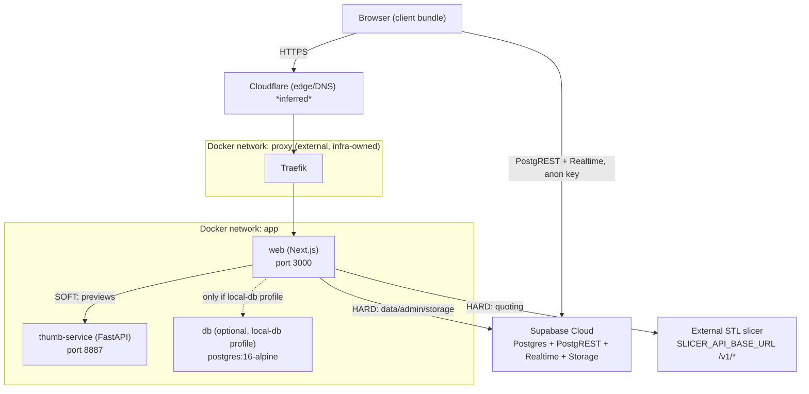
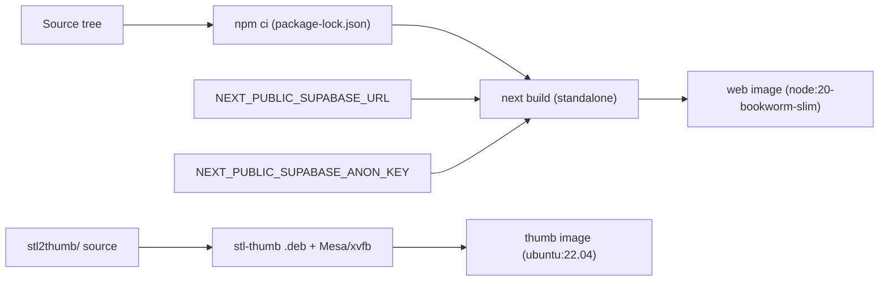
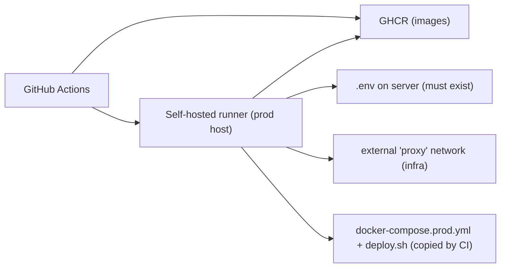
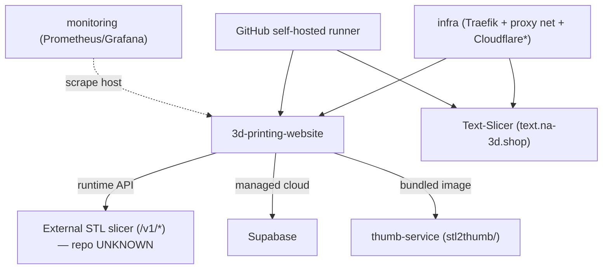

# DEPENDENCIES

> Dependency graph for `3d-printing-website`: which service depends on what, at
> build time, runtime, and deploy time. Inferred from the repository; unverifiable
> items are marked **UNKNOWN**. See `docs/ARCHITECTURE.md` for full context.

---

## Legend

- **Hard** = the feature/service breaks if the dependency is unavailable.
- **Soft** = degrades gracefully (feature disabled/skipped) but the app keeps running.
- **Build** = needed only to build the image. **Runtime** = needed while serving.
  **Deploy** = needed only during a deployment.

---

## Service Dependency Graph (runtime)

**Reading the graph:** The browser talks to the app through Cloudflare → Traefik → `web`,
and *also* talks directly to Supabase (Realtime subscriptions and anon‑key reads from
client components). Server‑side, `web` depends **hard** on Supabase (data, admin,
storage) and on the external slicer (quoting), and **soft** on `thumb-service` (previews).

---

## Build-time dependencies

| Build dependency | Consumer | Type | Notes |
|---|---|---|---|
| `package-lock.json` + npm registry | web image `deps` stage | Hard/Build | `npm ci` reproducible install |
| `NEXT_PUBLIC_SUPABASE_URL` / `_ANON_KEY` | web image `builder` stage | Hard/Build | Inlined into client bundle; captured as `SUPABASE_PUBLIC_URL_AT_BUILD` |
| Node ≥ 20 + glibc (Debian) | Tailwind v4 `@tailwindcss/oxide` | Hard/Build | Alpine/musl unsupported |
| `stl-thumb` `.deb` (GitHub releases) + Mesa/xvfb | thumb image | Hard/Build | Arch‑detected download at build |
| GitHub Actions cache (`type=gha`) | build job | Soft/Build | Speeds builds; not required |

---

## Runtime dependencies

| From | To | Type | Mechanism | Failure behavior |
|---|---|---|---|---|
| `web` | Supabase | **Hard** | `@supabase/ssr` + `supabase-js` (PostgREST/Realtime/Storage) | Data pages error; admin/checkout/gallery/RFQ fail |
| `web` | External STL slicer | **Hard** (quoting only) | `fetch` `POST /v1/slice`, poll `/v1/status` \| `/v1/tasks` | `503` from `/api/slicer`; rest of site fine |
| `web` | `thumb-service` | **Soft** | `fetch` `POST /generate` on network `app` | `preview_image: null` + `preview_error` |
| `web` | Supabase Storage (service role) | **Soft** | Uploads STL + preview PNG | Skipped with warning if service role missing |
| `web` | `db` (local-db) | Optional | Postgres on network `app` | Only if `COMPOSE_PROFILES=local-db` |
| `web` | host slicer via `host.docker.internal` | Conditional | Compose `extra_hosts: host-gateway` | Needed when slicer runs on the host, not in Compose |
| Browser | Supabase (Realtime/anon) | **Soft** | Client components subscribe for live printer status | `PrinterStatusLive`/`QueryError` fallback |
| Public | Traefik → `web` | **Hard** | External `proxy` network + Host label | Site unreachable if `proxy`/Traefik down |
| Public | Cloudflare | **Hard** *(inferred)* | DNS + TLS edge | DNS/TLS breaks publicly |

---

## Deploy-time dependencies

| Deploy dependency | Needed by | Type | Notes |
|---|---|---|---|
| GHCR reachable + `GITHUB_TOKEN` | build (push) & deploy (pull) | Hard/Deploy | Images pinned `:sha-<commit>` |
| Self‑hosted runner online | `deploy` job | Hard/Deploy | Labeled `self-hosted, macOS, ARM64, production` |
| `.env` present in `DEPLOY_PATH` | `deploy.sh` | Hard/Deploy | Script aborts if missing |
| External `proxy` network exists | `web` startup | Hard/Deploy | Created by the infra stack; deploy fails otherwise |
| `.last_successful_tag` | rollback | Soft/Deploy | Enables automatic rollback |
| `docker-compose.prod.yml` + `deploy.sh` | deploy | Hard/Deploy | Copied fresh by CI each run |

---

## npm dependency summary (from `package.json`)

Runtime‑relevant libraries and why they matter:

| Package | Role | Impact if changed |
|---|---|---|
| `next` 15.5.15 | Framework (App Router, SSR, Route Handlers) | Core; version pins build behavior |
| `react` / `react-dom` 19.1.0 | UI runtime | Core |
| `@supabase/ssr` / `@supabase/supabase-js` | Supabase clients (server + browser) | All data access |
| `framer-motion` | Animations | UI only |
| `lucide-react` | Icons | UI only |
| `react-dropzone` | STL upload UI | Quote flow |
| `recharts` | Admin analytics charts | Admin only |
| `canvas-confetti` | Grand‑opening effects | UI only |
| `server-only` | Guards server modules from client import | Safety boundary |
| `tailwindcss` v4 + `@tailwindcss/postcss` | Styling (needs Node ≥ 20 glibc) | Build/runtime styling |
| `typescript`, `eslint`, `eslint-config-next` | Dev tooling / CI `checks` | Gate builds |

Python (`stl2thumb/requirements.txt`): FastAPI + Uvicorn wrap the native `stl-thumb`
binary; system deps (Mesa, xvfb, tini) come from the `ubuntu:22.04` image.

---

## Cross-repository dependency map

- **`infra` must exist first** — it provides the `proxy` network and (inferred)
  Cloudflare tunnel. This repo cannot serve publicly without it.
- **`Text-Slicer`** is a *sibling*, **not** a dependency of this repo — no code path
  here calls it. They only share Traefik, the host, and the CI/deploy pattern.
- **External STL slicer** is the one true external runtime service dependency; its repo
  is **UNKNOWN** (not present in this workspace).
- **`monitoring`** observes the host; this repo does not depend on it.
- **`printer_re`** has no observed link to this repo.
