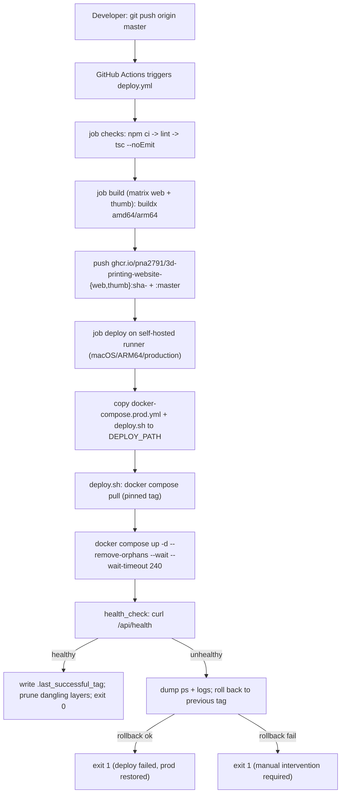
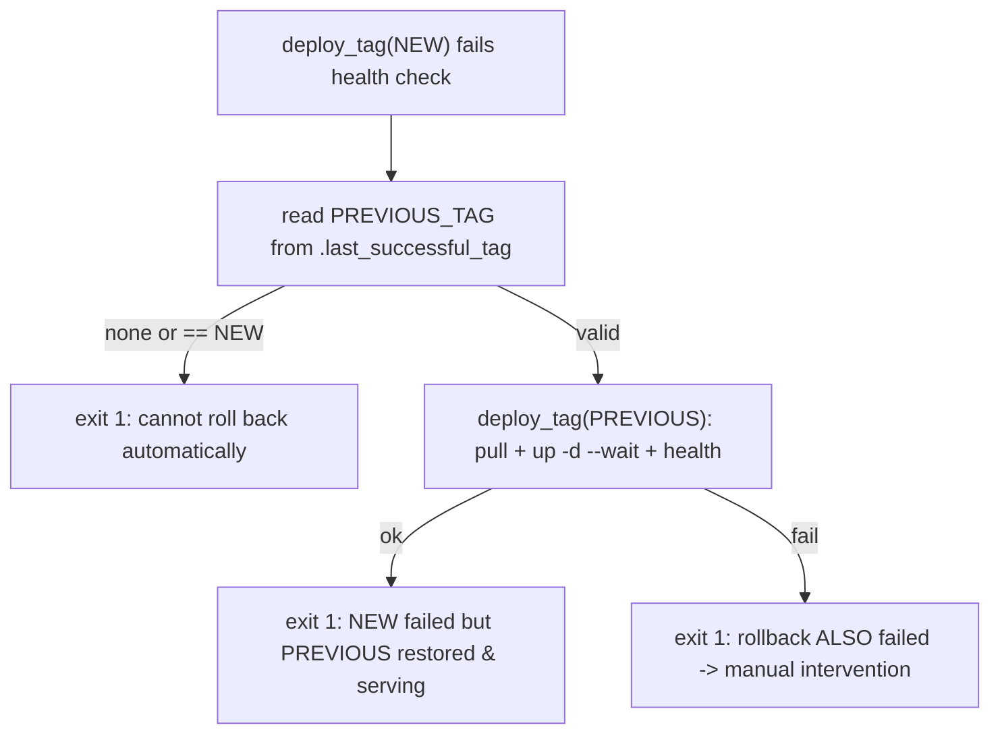

# DEPLOYMENT

> Exact deployment, rollback, and recovery procedure for `3d-printing-website`.
> Sourced from `.github/workflows/deploy.yml`, `scripts/deploy.sh`,
> `docker-compose.prod.yml`, and `Dockerfile`. Anything not verifiable from files is
> marked **UNKNOWN**.

---

## Summary

Deployment is **fully automated, image‑based, and pull‑only**. A push to `master`
builds multi‑arch images, pushes them to GHCR pinned by commit SHA, and a self‑hosted
GitHub runner **on the production machine** pulls those images and restarts the stack
with a health check and automatic rollback. Production **never builds, never clones the
repo, never receives SSH**, and CI **never touches `.env` or volumes**.



---

## Trigger

- **Automatic:** `push` to branch `master`.
- **Manual:** `workflow_dispatch` from the GitHub Actions UI.
- **Concurrency:** group `production-deploy`, `cancel-in-progress: false` — a newer push
  waits for the current deploy to finish instead of cancelling it mid‑flight (keeps
  rollback state consistent).

> The current working branch may differ (e.g. `link-service`); **only `master`
> deploys**. Merge/push to `master` to release.

---

## Step-by-step pipeline

### 1. `checks` (ubuntu-latest)
`actions/checkout` → `setup-node@20` (npm cache) → `npm ci` → `npm run lint` →
`npx tsc --noEmit`. A failure here stops the pipeline before any image is built.

### 2. `build` (ubuntu-latest, needs: checks)
Matrix over two images:

| name | context | dockerfile | image suffix |
|---|---|---|---|
| web | `.` | `./Dockerfile` | `-web` |
| thumb | `./stl2thumb` | `./stl2thumb/Dockerfile` | `-thumb` |

Steps: compute lowercase image name `ghcr.io/${GITHUB_REPOSITORY,,}-<suffix>` →
`setup-qemu` + `setup-buildx` → GHCR login (`GITHUB_TOKEN`) →
`docker/build-push-action@v6`:
- platforms `linux/amd64,linux/arm64`
- tags `:sha-<commit>` **and** `:master`
- build args `NEXT_PUBLIC_SUPABASE_URL`, `NEXT_PUBLIC_SUPABASE_ANON_KEY` (from Secrets;
  the thumb image ignores them)
- cache `type=gha` (scoped per image), `provenance: false`

### 3. `deploy` (self-hosted: macOS, ARM64, production; needs: build)
Runs **on the production host**. Steps:
1. `actions/checkout` (to get the compose file + deploy script).
2. GHCR login with `GITHUB_TOKEN` (login‑action logs out in its post step, so no
   credentials linger on the machine).
3. Run the deploy shell:
   ```bash
   DEPLOY_PATH="${DEPLOY_PATH:-/Users/creator/na-3d-prod/3d-printing-website}"
   REPO_LC="$(printf '%s' "$GITHUB_REPOSITORY" | tr '[:upper:]' '[:lower:]')"
   mkdir -p "$DEPLOY_PATH"
   cp docker-compose.prod.yml scripts/deploy.sh "$DEPLOY_PATH/"   # ONLY these two files
   cd "$DEPLOY_PATH"
   WEB_IMAGE_REPO="ghcr.io/${REPO_LC}-web" \
   THUMB_IMAGE_REPO="ghcr.io/${REPO_LC}-thumb" \
   IMAGE_TAG="$IMAGE_TAG" \
   bash deploy.sh
   ```
   (macOS runner uses bash 3.2 → no bash‑4 syntax like `${VAR,,}`.)

### 4. `deploy.sh` on the host
1. Assert `WEB_IMAGE_REPO`, `THUMB_IMAGE_REPO`, `IMAGE_TAG` are set.
2. Assert `docker-compose.prod.yml` and `.env` exist (**abort** if `.env` missing —
   never auto‑create it).
3. `deploy_tag(IMAGE_TAG)`:
   - `docker compose -f docker-compose.prod.yml pull` (with `WEB_IMAGE`/`THUMB_IMAGE`
     set to `<repo>:<tag>`)
   - `docker compose up -d --remove-orphans --wait --wait-timeout 240` (blocks until all
     containers report healthy)
   - `health_check`: external `curl -fsS http://127.0.0.1:${WEB_PORT}/api/health`, 60s
     deadline.
4. On success: write `IMAGE_TAG` to `.last_successful_tag`, `docker image prune -f`
   (dangling layers only — keeps previous tagged images for rollback), exit 0.
5. On failure: dump `compose ps` + `logs --tail=100`, then roll back (below).

---

## Environment / configuration on the server

The deploy directory (`DEPLOY_PATH`) must contain a **hand‑maintained `.env`** with at
least:

- `NEXT_PUBLIC_SUPABASE_URL`, `NEXT_PUBLIC_SUPABASE_ANON_KEY` (must match the values
  baked into the image at build time)
- `SUPABASE_SERVICE_ROLE_KEY` (admin/checkout/gallery/RFQ/storage)
- `SLICER_API_BASE_URL` (external STL slicer)
- `ADMIN_ANALYTICS_SECRET`, `ANALYTICS_IP_SALT`, `ANALYTICS_ALLOWED_HOSTS`
- thumbnail vars (`STL2THUMB_*`) as needed; `WEB_PORT` if not 3000

See the full table in `docs/ARCHITECTURE.md → Configuration`. The `WEB_IMAGE` /
`THUMB_IMAGE` refs are **not** in `.env`; `deploy.sh` exports them from
`*_IMAGE_REPO` + `IMAGE_TAG`.

---

## Secrets & variables (GitHub side)

| Kind | Name | Used by |
|---|---|---|
| Secret | `NEXT_PUBLIC_SUPABASE_URL` | build args |
| Secret | `NEXT_PUBLIC_SUPABASE_ANON_KEY` | build args |
| Secret | `GITHUB_TOKEN` (auto) | GHCR push (build), pull (deploy) |
| Variable | `DEPLOY_PATH` | deploy job (defaults to `/Users/creator/na-3d-prod/3d-printing-website`) |
| Environment | `production` | gates the `deploy` job |

Server‑only secrets (service role, admin secret, IP salt, `DATABASE_URL`) are **not** in
GitHub — they live only in the server `.env`.

---

## Rollback

Rollback is **automatic** and driven by `.last_successful_tag`:



- The previous images are **still present locally** because `deploy.sh` only prunes
  *dangling* layers, never tagged images. So rollback is a fast local `up -d`.
- `.last_successful_tag` is updated **only** after a fully healthy deploy, so it always
  points at a known‑good release.

**Manual rollback** (from `DEPLOY_PATH`):
```bash
WEB_IMAGE_REPO=ghcr.io/pna2791/3d-printing-website-web \
THUMB_IMAGE_REPO=ghcr.io/pna2791/3d-printing-website-thumb \
IMAGE_TAG=sha-<known-good-commit> \
bash deploy.sh
```
Or force a specific known‑good release by re‑running the workflow / re‑pushing that commit
to `master`.

---

## Recovery scenarios

| Scenario | Recovery |
|---|---|
| **New deploy is broken** | Automatic rollback restores the previous tag. Fix the code and push a new commit to `master`. |
| **No `.last_successful_tag` yet (first deploy fails)** | No auto‑rollback possible. Fix the issue and redeploy; or manually `deploy.sh` with a known image tag. |
| **`.env` missing/corrupted on host** | `deploy.sh` aborts. Recreate `.env` by hand (secrets are not in git); re‑run deploy. |
| **`proxy` network missing** | Bring up the infra/Traefik stack first (`docker network ls` should show `proxy`), then redeploy. |
| **GHCR unreachable / auth failure** | Running containers keep serving. Fix token/permissions; the site stays up until you can pull. |
| **Runner offline** | Builds still publish to GHCR; deploy waits. Bring the self‑hosted runner back, then re‑run the `deploy` job or manually run `deploy.sh` on the host. |
| **Full host rebuild (disaster recovery)** | 1) Recreate `~/na-3d-prod/{infra,3d-printing-website}`. 2) Restore each `.env`. 3) Bring up infra (`proxy` network + Traefik). 4) Register the GitHub self‑hosted runner. 5) Re‑run the workflow (or manual `deploy.sh`) to pull images. 6) Reapply Supabase migrations only if the DB itself was lost. **Cloudflare/tunnel restore steps are UNKNOWN — see the infra repo.** |
| **Database change needed** | Migrations are **not** run by CI. Apply `supabase/migrations/*.sql` in order via the Supabase SQL editor or `scripts/apply-supabase-sql.sh` with `DATABASE_URL`. |

---

## What deployment guarantees (invariants)

- **Zero build on production** — only `pull` + `up -d`.
- **Immutable, pinned images** — `:sha-<commit>`, never `:latest`.
- **`.env` never created or overwritten by CI.**
- **Volumes never removed** — no `down -v`; `postgres_data` preserved.
- **Only two files synced to the host** — `docker-compose.prod.yml` and `deploy.sh`.
- **Health‑gated** — a deploy that fails `/api/health` is rolled back, not left broken.
- **No inbound SSH** — deploy runs via the outbound‑polling self‑hosted runner.

---

## Manual / legacy paths

- `push_image.sh` pushes a locally built image to **Docker Hub** (`ngocanhknx/...`).
  This is a manual/legacy helper and is **not** part of the GHCR‑based CI pipeline; do
  not use it for production releases.
- `docker-compose.yml` (root, with `build:` sections) is for **local** builds only, never
  for the production host.
